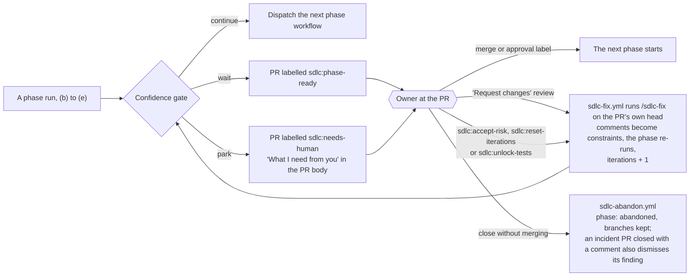
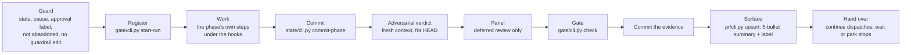

# How a project uses the framework

A picture of `docs/OPERATING_MODEL.md` as of plugin 0.2.19: what a project does once to connect, how one change travels from idea to production, and what happens when the owner does not simply merge. The operating model stays the contract; where this page and it disagree, it wins.

Legend: hexagons are the owner's acts on GitHub (merge, review, label, close); rectangles are runs and workflows under the automation identity; dashed arrows are the Full profile or an optional path.

## 1. The whole life of a project

```mermaid
flowchart TB
  subgraph SETUP["Once per project"]
    I0["Owner runs /sdlc:sdlc-init<br/>detects build, test, lint, setup commands<br/>asks profile, review mode, deploy adapter, metric"]
    I1["Change 0000 PR<br/>sdlc.yaml, .claude/settings.json, CLAUDE.md, REVIEW.md,<br/>changes/, bands.yaml, evals/, lessons/, .github/workflows/sdlc-*.yml"]
    I2{{"Owner merges the 0000 PR"}}
    I0 --> I1 --> I2
  end

  subgraph PA["(a) plan: interactive"]
    A1["Owner runs /sdlc-plan 'idea'<br/>brainstorm, then intent.md via the intent-template skill"]
    A2["Intent PR on sdlc/id/a"]
    A1 --> A2
  end
  I2 --> A1
  A2 --> GA{{"Gate (a)<br/>owner merges the intent PR"}}

  subgraph PB["(b) design: autonomous"]
    B1["/sdlc-design<br/>policy skills, then spec.md<br/>read-only planning run, then plan.md"]
    B2["Confidence gate (b)<br/>deterministic checks + adversarial reviewer"]
    B1 --> B2
  end
  GA -- "merge fires sdlc-design.yml" --> B1
  B2 -- "wait: sdlc:b-ready" --> GB{{"Gate (b)<br/>owner merges the spec+plan PR"}}

  subgraph PC["(c) build: autonomous"]
    C1["/sdlc-build on sdlc/id/c<br/>preflight; a fix writes its failing test first and locks tests<br/>implementation under the hooks, code-simplifier, verifier"]
    C2["Confidence gate (c)<br/>build PR opened as a draft"]
    C1 --> C2
  end
  GB -- "merge fires sdlc-build.yml" --> C1

  subgraph PD["(d) test: autonomous, fresh context"]
    D1["/sdlc-test<br/>collect.py runs test, build, lint into evidence/<br/>failures fixed and re-run, screenshot loop, verifier"]
    D2["Confidence gate (d)<br/>check run on the PR"]
    D1 --> D2
  end
  C2 -- "Standard: continue,<br/>dispatches sdlc-test.yml" --> D1
  C2 -. "Full: sdlc:c-ready, owner approves<br/>and applies sdlc:c-approved" .-> D1

  subgraph PE["(e) deploy: autonomous"]
    E1["REVIEW.md pass in a fresh context<br/>/sdlc-deploy prepares the release artifact per deploy.action<br/>fix loop while an Important finding stands"]
    E2["Confidence gate (e)<br/>release-notes.md, PR ready, sdlc:e-ready"]
    E1 --> E2
  end
  D2 -- "Standard: continue,<br/>dispatches sdlc-deploy.yml" --> E1
  D2 -. "Full: sdlc:d-ready, owner approves<br/>and applies sdlc:d-approved" .-> E1
  E2 --> GE{{"Gate (e)<br/>owner merges the build PR"}}

  GE -- "merge fires sdlc-release.yml" --> R1["release/cli.py run<br/>runs sdlc.yaml deploy.command"]
  GE -. "deploy.production: true" .-> RA{{"Owner applies<br/>sdlc:release-approved"}}
  RA -.-> R1
  R1 --> LIVE(["Change is live"])

  subgraph PF["(f) maintain: standing loop"]
    F1["sdlc-detect.yml, daily<br/>metric against bands.yaml, Western Electric rules, no model"]
    F2["sdlc-scan.yml, weekly<br/>security review + deterministic scanners"]
    F3["Incident change filed<br/>/sdlc-maintain --diagnosis-only reads lessons/, investigates read-only<br/>incident intent.md + proposal.json, route dispatched"]
    F1 -- "2σ or 3σ breach" --> F3
    F2 -- "Important finding" --> F3
  end
  LIVE --> F1
  F3 --> GF{{"Gate (f): owner triages the incident PR<br/>merge = fix now · schedule · close with a comment = dismiss"}}
  GF -- "merge is gate (a) of the incident change" --> B1
  F3 -. "3σ runbook route with go" .-> GO{{"Owner applies sdlc:go"}}
  GO -.-> RB["sdlc-runbook.yml runs the runbook once<br/>quarantine-flaky-test, revert-pr or a project runbook"]
```

An incident change ships through (b) to (e) like any other; its (e) run also writes `lessons/<yyyy-mm>-<slug>.md` and one eval case under `evals/cases/`, which the next diagnosis and `sdlc-evals.yml` read.

## 2. When the owner does not just merge

Every phase run ends at the confidence gate with one of three outcomes. Nothing ever notifies the owner: parked and ready PRs wait in the review queue (the PR list filtered by `sdlc:*-ready` and `sdlc:needs-human`, summarised daily by `sdlc-digest.yml` in one pinned issue).

What always parks, in both review modes: a risk-list hit, a guardrail file change, a run limit (iterations, panel calls, wall clock, budget, pause), an infrastructure failure. With `review: deferred`, the other judgment items (an open flagged concern, an `escalate` verdict, an Important finding the run cannot fix, the verifier's "does not match the plan") go to a three-member review panel instead, and the next PR opens with "Decisions taken for you (N)"; a review comment on any line overturns it.

## 3. Inside one phase run

The same skeleton for `/sdlc-design`, `/sdlc-build`, `/sdlc-test` and `/sdlc-deploy`, whether run by hand or by `plugin/ci/run_phase.py` in a workflow job.

The hooks active in every session on the project: protected paths (guardrail files and the plugin itself), secrets check, plan sync on `git commit`, formatter on edit, the test-file lock for fix-type changes, and the production gate that blocks a guarded deploy command until the owner's release approval exists.

## 4. Who does what

| Step | The owner | The framework (automation identity) |
|---|---|---|
| Setup | runs `/sdlc-init`, answers one round of questions, merges the 0000 PR | writes the config, guardrails and workflows into the PR |
| (a) plan | runs `/sdlc-plan`, brainstorms, merges the intent PR | writes `intent.md`, opens the PR |
| (b) design | merges the spec+plan PR | writes `spec.md` and `plan.md`, runs the gate |
| (c) build, (d) test | Full only: approves and labels each | implements, tests, collects evidence, runs the gates |
| (e) deploy | merges the build PR; applies `sdlc:release-approved` on a real production | reviews, fixes, prepares the release, then runs `deploy.command` |
| (f) maintain | triages each incident PR; applies `sdlc:go` for a runbook that needs it | detects, scans, diagnoses read-only, proposes |
| Any gate | "Request changes", an un-park label, or closes the PR | fix round, un-park, or abandon |

Every phase command can also be run by hand in a Claude Code session in place of its workflow; the `README.md` lists the order.
